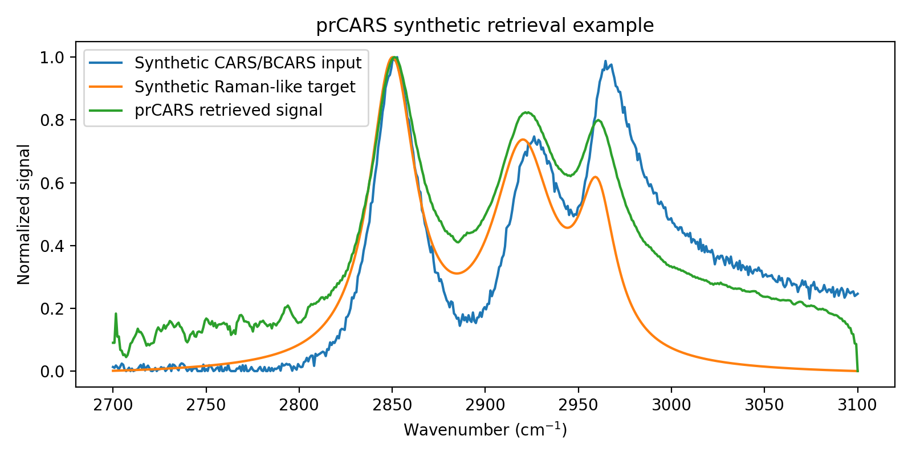

# prCARS


**prCARS** is a Python toolkit for phase retrieval, non-resonant-background correction, preprocessing, and Raman-like signal reconstruction from Coherent Anti-Stokes Raman Scattering (CARS/BCARS) spectra.

It provides a modular pipeline for recovering Raman-like information using classical retrieval methods — Kramers-Kronig and the Maximum Entropy Method — with an optional neural-network retrieval interface.

---

## Why this project matters

CARS and BCARS spectra carry chemically meaningful Raman-like information, but the measured signal is distorted by the non-resonant background, interference effects, instrument response, noise, and baseline artifacts. Recovering the underlying Raman-like signal is therefore an inverse problem, and the answer depends on the preprocessing and retrieval choices made along the way.

prCARS makes those choices explicit and comparable. It provides a research-oriented workflow for:

- preprocessing CARS/BCARS spectra
- estimating and correcting background contributions
- retrieving Raman-like spectral content
- comparing retrieval methods against a known target
- testing phase-retrieval pipelines on synthetic examples

The goal is to make CARS/BCARS retrieval easier to test, compare, and integrate into scientific machine-learning workflows.

---

## Example output



---

## Quickstart

prCARS ships with a synthetic data generator, so this runs with no data files:

```python
import prcars as pc
from prcars.utils import synthetic_cars

wavenumbers, cars_raw, im_true = synthetic_cars(seed=0)

result = pc.retrieve(wavenumbers, cars_raw, method="kk")

print(result.im_chi3.shape)
```

The recovered `im_chi3` signal is the Raman-like target extracted from the CARS/BCARS
spectrum. Comparing it against `im_true` shows how well retrieval recovered the known
ground truth.

With your own data:

```python
import numpy as np
import prcars as pc

wavenumbers = np.load("wavenumbers.npy")
cars_raw = np.load("cars_spectrum.npy")

result = pc.retrieve(wavenumbers, cars_raw)
im_chi3 = result.im_chi3
```

---

## Key features

**Retrieval methods**
- Kramers-Kronig phase retrieval
- Maximum Entropy Method retrieval
- Optional neural-network retrieval interface (experimental)

**Background estimation**: ALS, polynomial fitting, SNIP, rolling-ball
**Background correction**: subtract, divide, square-root divide
**Denoising**: Savitzky-Golay, Wiener, wavelet-based

Also: optional phase-matching correction, automatic phase correction with silent-region
optimization, synthetic CARS example generation, benchmark utilities for comparing
retrieval results, and a reusable `Pipeline` object for reproducible workflows.

---

## Project status

prCARS is **alpha-stage research software**.

| Component | Status |
|---|---|
| Kramers-Kronig retrieval | Implemented |
| MEM retrieval | Implemented |
| Background estimation | Implemented |
| Background correction | Implemented |
| Denoising utilities | Implemented |
| Synthetic CARS utility | Implemented |
| Benchmark helper utilities | Implemented |
| Unit tests | Implemented |
| GitHub Actions CI | Implemented |
| Citation metadata | Implemented |
| Neural-network retrieval interface | Experimental / optional |
| Changelog | Planned |
| Real-data validation workflow | Planned |
| Integration with CARSBench | Planned |
| Integration with CARSGuard | Planned |
| Full documentation site | Planned |

---

## Installation

```bash
git clone https://github.com/rhouhou/prCARS.git
cd prCARS
```

Create and activate a virtual environment:

```bash
python -m venv .venv

# macOS / Linux
source .venv/bin/activate

# Windows
.venv\Scripts\activate
```

Install the package in editable mode:

```bash
python -m pip install --upgrade pip setuptools wheel
python -m pip install -e .
```

Optional extras:

```bash
python -m pip install -e ".[dev]"       # development tools
python -m pip install -e ".[plot]"      # plotting helpers
python -m pip install -e ".[wavelet]"   # wavelet denoising
python -m pip install -e ".[torch]"     # optional PyTorch backend
```

For most local development:

```bash
python -m pip install -e ".[dev,plot,wavelet]"
```

On systems where the interpreter is `python3`, substitute `python3` throughout.

### Installation check

```bash
python -c "import prcars; print(prcars.__name__)"
python -m pytest
```

Expected output from the first command:

```text
prcars
```

---

## Retrieval methods

### Kramers-Kronig

```python
result = pc.retrieve(wavenumbers, cars_raw, method="kk")
```

With full control:

```python
result = pc.retrieve(
    wavenumbers,
    cars_raw,
    method="kk",
    background="als",
    correction="divide",
    denoise="savgol",
    auto_phase=True,
    silent_region=(2700, 2730),
    retriever_kw={"zero_pad_factor": 8},
)
```

### Maximum Entropy Method

```python
result = pc.retrieve(
    wavenumbers,
    cars_raw,
    method="mem",
    background="snip",
    correction="divide",
    retriever_kw={
        "order": 128,
        "solver": "burg",
        "phase_method": "kk",
    },
)
```

### Neural-network retrieval (experimental)

Requires an additional backend such as PyTorch or TensorFlow.

```python
result = pc.retrieve(
    wavenumbers,
    cars_raw,
    method="nn",
    background="als",
    retriever_kw={
        "model_name": "cars_unet_v1",
        "backend": "torch",
    },
)
```

This interface is experimental and intended for future learned retrieval workflows.

---

## Pipeline object

For reproducible workflows, apply the same configuration to many spectra:

```python
pipeline = pc.Pipeline(
    method="kk",
    background="als",
    correction="divide",
    denoise="savgol",
    auto_phase=True,
    silent_region=(2700, 2730),
)

result_1 = pipeline.run(wavenumbers, spectrum_1)
result_2 = pipeline.run(wavenumbers, spectrum_2)
```

---

## Preprocessing and retrieval options

| Step | Options |
|---|---|
| Background estimation | `als`, `polynomial`, `snip`, `rolling_ball`, `none` |
| Background correction | `subtract`, `divide`, `sqrt_divide`, `none` |
| Denoising | `savgol`, `wiener`, `wavelet`, `none` |
| Retrieval | `kk`, `mem`, `nn` |
| Phase correction | automatic silent-region optimization |

---

## Benchmarking

Compare retrieval methods against a known synthetic target:

```python
from prcars.utils import synthetic_cars, benchmark

wavenumbers, cars_raw, im_true = synthetic_cars(seed=0)

scores = benchmark(wavenumbers, cars_raw, im_true, methods=["kk", "mem"])

for method, values in scores.items():
    print(method, values)
```

These utilities are intended for sanity checks and method comparison, not as a
substitute for validation on experimental data.

---

## Typical workflow

```text
Load CARS/BCARS spectrum
Preprocess / denoise signal
Estimate background
Apply background correction
Run phase retrieval
Apply optional phase correction
Inspect Raman-like output
Compare against reference or synthetic target
```

---

## Repository structure

```text
prCARS/
  examples/       Example scripts and usage demos
  prcars/
    __init__.py
    pipeline.py
    result.py
    methods/      kk.py, mem.py, nn.py
    corrections/  background.py, denoise.py, phase.py, phase_matching.py
    networks/     Optional neural-network model utilities
    utils/        Synthetic data, benchmarking, plotting helpers
  tests/          Unit and pipeline tests
  sanity_check.py
  pyproject.toml
```

---

## Documentation

- [`docs/methods.md`](docs/methods.md)
- [`docs/preprocessing.md`](docs/preprocessing.md)
- [`docs/examples.md`](docs/examples.md)
- [`docs/integration.md`](docs/integration.md)

---

## The CARS/BCARS ecosystem

prCARS is the retrieval layer of a three-part workflow:

```text
CARSBench  → simulate benchmark spectra under controlled domain shifts
prCARS     → retrieve Raman-like spectra
CARSGuard  → validate plausibility, consistency, and artifact risk
```

| Project | Role |
|---|---|
| [CARSBench](https://github.com/rhouhou/CARSBench) | Simulates CARS/BCARS spectra under controlled domain shifts |
| prCARS | Retrieves Raman-like signals from CARS/BCARS spectra |
| [CARSGuard](https://github.com/rhouhou/CARSGuard) | Validates spectra and retrieval outputs |

---

## Limitations

prCARS is research and educational software. Current limitations:

- it is not a substitute for experimental validation
- retrieval quality depends on preprocessing choices and input signal quality
- neural-network retrieval is experimental and optional
- real-data validation workflows are still planned
- results should be interpreted carefully when applied to real biological spectra

This project is **not intended for clinical diagnosis, medical decision-making, or
deployment in real healthcare settings**.

---

## Roadmap

- Improve test coverage for retrieval methods and correction utilities
- Expand CI with optional backend tests for PyTorch or TensorFlow
- Add a changelog and release notes
- Expand documentation pages for retrieval methods and preprocessing choices
- Add stronger synthetic benchmark reports
- Add integration examples with CARSBench and CARSGuard
- Add real CARS/BCARS data examples where licensing allows
- Improve neural-network retrieval documentation

---

## Citation

If you use prCARS in research, education, or benchmarking work, please cite it using the
metadata in [`CITATION.cff`](CITATION.cff).

```bibtex
@misc{prcars2026,
  title={prCARS: Phase Retrieval and Raman-like Signal Reconstruction for CARS/BCARS Spectroscopy},
  author={Houhou, Rola},
  year={2026},
  note={Alpha research software},
  url={https://github.com/rhouhou/prCARS}
}
```

---

## License

MIT. See [`LICENSE`](LICENSE).

---

*Part of my research on biophotonics and machine learning — [biophotonics-ai.de](https://biophotonics-ai.de)*